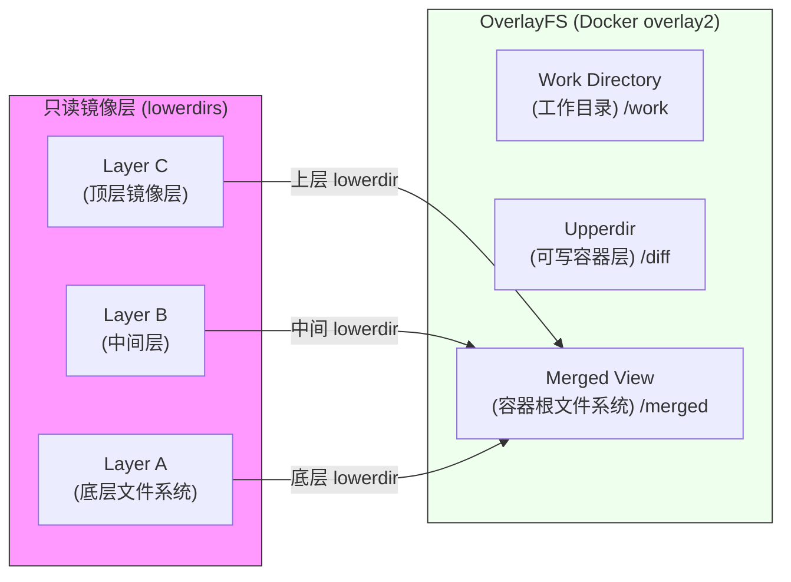
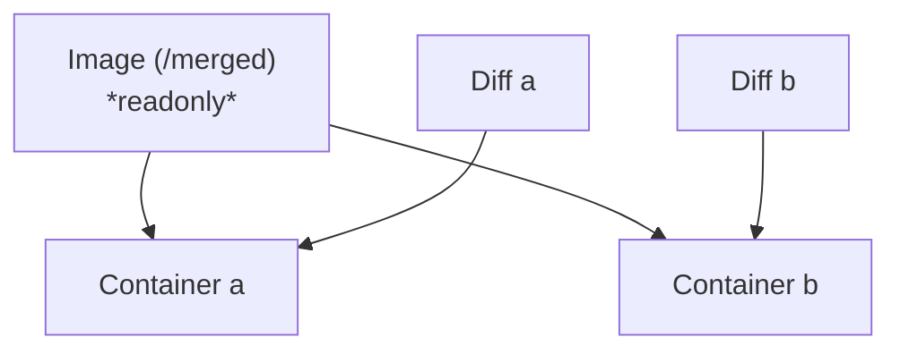

# Docker 简介

## Docker 的作用


---

# Docker 的作用

### Docker

Docker 将应用及其所需要的环境打包并交付给其他人使用, 使得应用能够在一致的环境下一键运行, 而不需要手动配置环境

### 特点

- 更高效的利用系统资源
- 更快速的启动时间
- 更方便持续交付和部署
- ~~更容易因为维护失误吃校园网工单~~

---

# Docker 中的重要概念：镜像、容器与 Registry

### 镜像（Image）

Docker 镜像是一个特殊的文件系统

<div style="display: flex; justify-content: space-around; flex-direction: row">
<div style="width: 45%;">

- 提供容器运行时所需的程序、库、资源、配置等文件
- 包含一些为运行时准备的一些配置参数
- 不包含任何动态数据, 其内容在构建之后也不会被改变
- 在 Linux 中实现为 OverlayFS

</div><div style="flex: 1">



</div>
</div>

---

# Docker 中的重要概念：镜像、容器与 Registry

### 镜像（Image）

Docker 镜像的构建：Dockerfile

<div style="width: 60%; margin: auto;">


</div>

- 语法规范详见：[https://yeasy.gitbook.io/docker_practice/image/dockerfile](https://yeasy.gitbook.io/docker_practice/image/dockerfile)
- 之后使用 docker build 命令构建镜像

---

# Docker 中的重要概念：镜像、容器与 Registry

<div style="display: flex; justify-content: space-around; flex-direction: row">

<div style="width: 45%;">

### 容器（Container）

- 镜像的**实例**：镜像是静态的定义, 容器是镜像运行时的实体
- 具有**易失性**：任何保存于容器存储层的信息都会随容器删除而丢失（大作业需要将用户数据保存在持久化存储中）

容器的启动：

- （本地）docker run -d -p 10001:8000 --name &lt;Container Name&gt; &lt;Image&gt;
- （其他部署工具）查阅对应文档...

</div>
<div style="flex: 1; display: flex; flex-direction: column; justify-content: center;">



</div>
</div>

---

# Docker 中的重要概念：镜像、容器与 Registry

### Registry

概念辨析：仓库（Repository）、注册服务器（Registry）
- 镜像构建完成后, 可以很容易的在当前宿主机上运行, 但是, 如果需要在其它服务器上使用这个镜像, 我们就需要一个集中的存储、分发镜像的服务, Docker Registry 就是这样的服务. 
- 一个 Docker <span style="color: purple">Registry</span> 中可以包含多个<span style="color: orange">仓库（Repository）</span>；每个仓库可以包含多个<span style="color: green">标签（Tag）</span>；每个标签对应一个<strong>镜像</strong>.

如, <span style="color: purple">docker-mirror.net9.org</span>/<strong><span style="color: orange">library/nginx</span>:<span style="color: green">alpine</span></strong>

---

# Docker 中的重要概念：镜像、容器与 Registry

### Registry

<div style="width: 70%; margin: auto;">


</div>

概念辨析：Docker Hub; 图中的 python;  python:3.9.16

---

# Dockerfile 编写入门

<div style="display: flex; justify-content: space-between; flex-direction: row; gap: 1em">
<div style="flex: 1;">

###

参考 [课程文档 Docker 部分](https://thuse-course.github.io/course-index/deploy/docker/), [2023 酒井科协暑培 Docker 课程](https://summer23.net9.org/sast2023-docker/), [2024 科协算协联合暑培 Docker 课程](https://summer24.net9.org/backend/docker/prerequisites/)

简单地说:

- Dockerfile 中可以包含多个镜像 (每一个 FROM 以后的内容是一个新的镜像);
- 每一个镜像有多个层 (每一个 RUN, COPY, ADD 等命令会创建一个新的镜像层);
- 每一层在创建时会基于它的上一层, 每一层存储了 Diff
- 最后用 CMD 和 ENTRYPOINT 指定容器启动时运行的命令

</div>
<div style="width: 45%;">
<!-- <div style="--scale: 1; transform: scale(var(--scale)); transform-origin: top left; width: calc(100% / var(--scale));"> -->

```dockerfile
FROM docker-mirror.net9.org/library/node:22 AS build
COPY package.json pnpm-lock.yaml ./
RUN npm install -g pnpm@latest-10; \
    pnpm install;
COPY . .
RUN pnpm build;

# Starting from here is a new image
FROM docker.net9.org/library/node:22 AS dist
EXPOSE 80
ENV PORT=80
ENV HOSTNAME=0.0.0.0
CMD ["node", "server.js"]
```

<!-- </div> -->
</div>
</div>

---